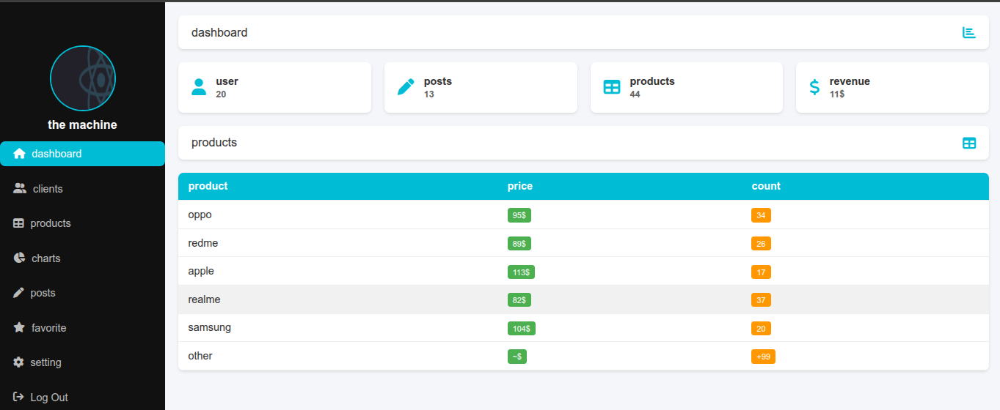

# 📊 Dashboard Project

A simple and responsive dashboard template built using **HTML**, **CSS**, and **Font Awesome** icons.
The dashboard includes a sidebar navigation menu, summary cards, and a products table.

---

## 🛠️ Tools & Installation

No external installations required. Just clone the repository and open `index.html` in your browser.

**Tools used:**

* HTML5
* CSS3
* [Font Awesome 6](https://fontawesome.com/)

---

## 🚀 Features

* Sidebar navigation with profile section
* Dashboard summary (users, posts, products, revenue)
* Product listing table with price and stock count
* Clean and responsive layout

---

## 📸 Screenshots


---

## 🌐 Demo


```
[Live Demo](https://username.github.io/dashboard2)
```

---

## 👨‍💻 Author

Developed by **Walid (the machine developer)**
